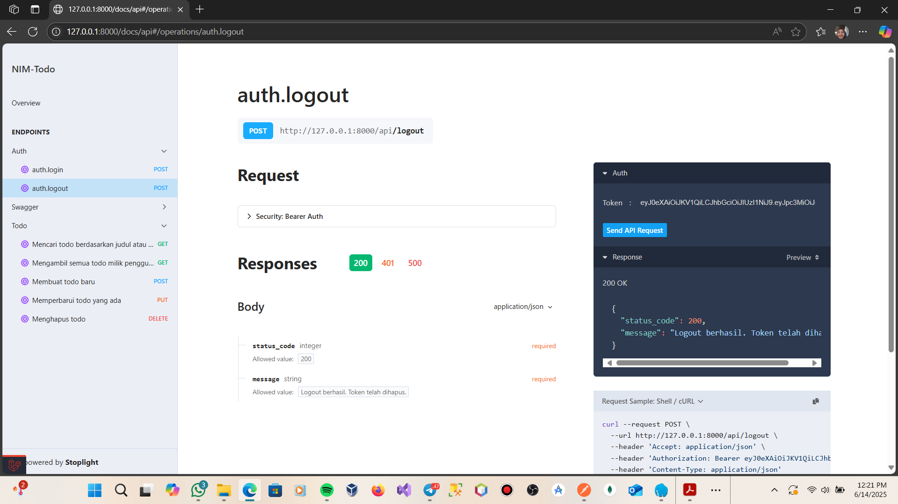

## LogOut

## Endpoint untuk mengambil semua data Todo

## Endpoint untuk menambah data Todo baru

## Endpoint untuk mengubah Todo

## Endpoint untuk menghapus Todo

## Endpoint untuk melakukan pencarian pada Todo

